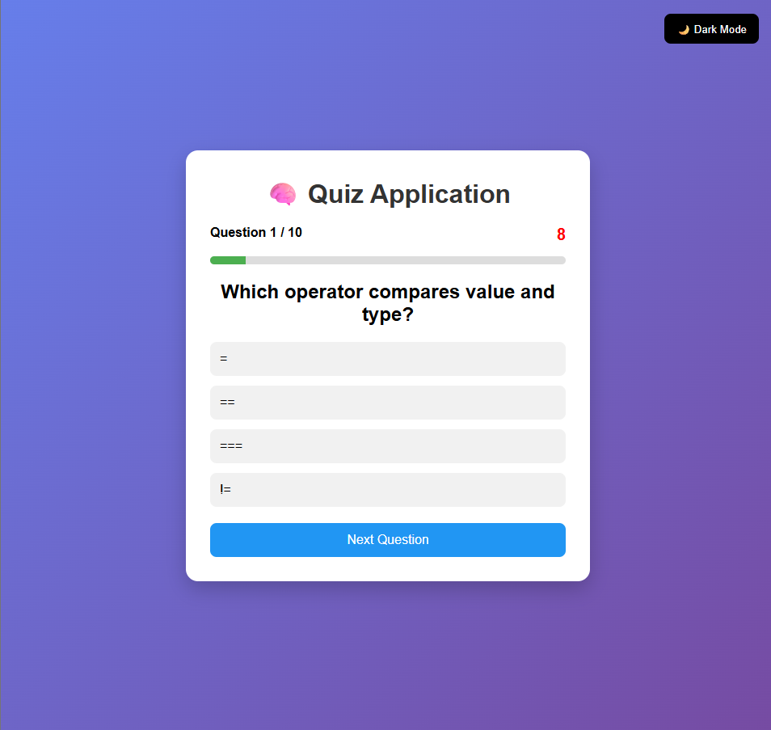
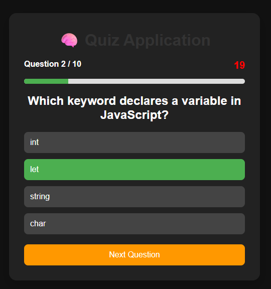
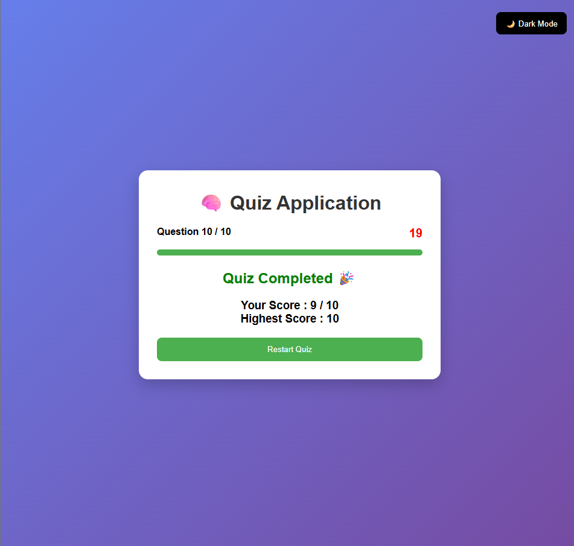

# 🧠 Quiz Application

A responsive Quiz Application built using HTML, CSS, and JavaScript.

## ✨ Features

- 📝 Multiple Choice Questions
- ⏱️ Countdown Timer
- 📊 Progress Bar
- 🏆 High Score using Local Storage
- 🌙 Dark Mode
- 🔄 Restart Quiz
- 📱 Responsive Design

## 🛠️ Technologies Used

- HTML5
- CSS3
- JavaScript

## 📂 Project Structure

```
Quiz-Application
│── index.html
│── style.css
│── script.js
│── README.md
│── screenshots/
```
[](https://srisakshi-12.github.io/Quiz-Application/)

## 🚀 How to Run

1. Download or clone the repository.
2. Open `index.html` in your browser.

## 📸 Project Output

### Home Screen



### Quiz Screen



### Result Screen



## 👩‍💻 Author

Karnatakam Sakshi
